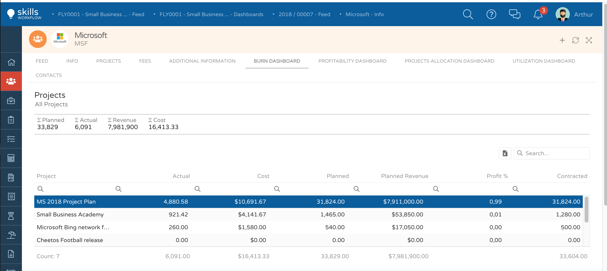

Burn
====

1. Go to the client module
2. Select the client you want to check
3. Press on Burn Dashboard 

You will find out a summary with total indicators:

Planned, actual, revenue and cost 

1. Select the project you wish to analyze
    
    * The system will display several graphics with detailed information related to the selected project
    * You will be able to check total values for that specific project such as contracted hours, planned hours, actual hours, planned revenue, and actual cost.
    * Also, you will be able to find the burn percentage (planned - actual hours)

**Project Time Burn**

    * This representation will show you a monthly distribution of planned versus actual hours.
    * You will find out the same representation of the accumulated values as well.

**Project Revenue Burn**

    * This representation will show you a monthly distribution of planned revenue versus actual cost (based on user cost*actual hours).
    * You will also find out the same representation of the corresponding accumulated values