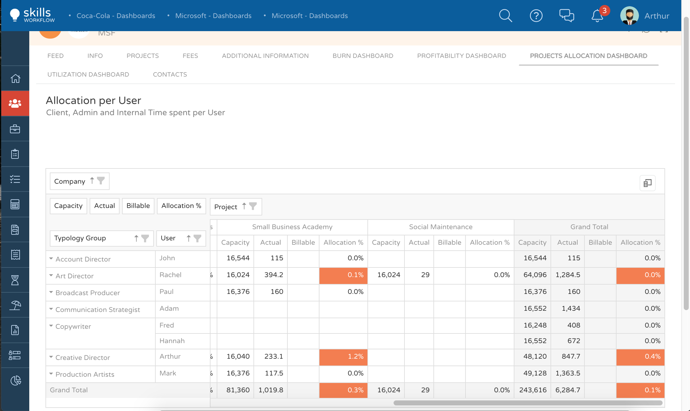
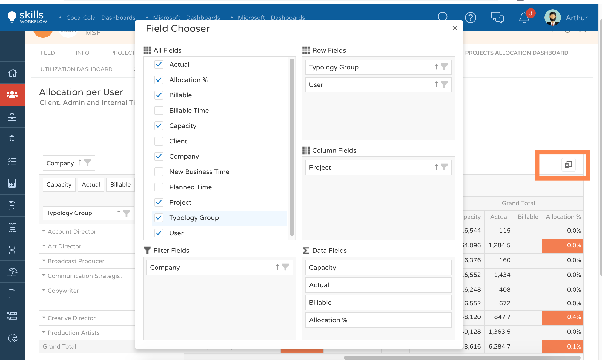

Project Allocation
==================

1. Go to the client module;
2. Select the client you want to check;
3. Press on Project Allocation Dashboard 

Project Allocation Dashboard will show you a table where you can check the following information per project:

1. Users Capacity;
2. Actual hours already registered in the system;
3. Billable hours registered;
4. Allocation %;

Please note that this dashboard is a table and allows you to add more fields if needed.

To do so you should press on the icon at your right (marked in orange), and the system will show a field chooser as an Excel pivot table.

Please note that you can either export to excel or print out this dashboard by pressing outside the grid with the right function of your mouse. 