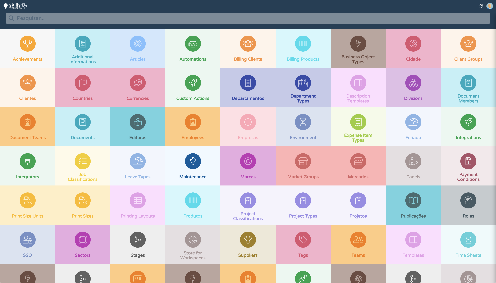

Configuration
=============

In this section you will be able to find all the available workspaces.

They are ready to be imported into your system.

Please use the :doc:`store </store/workspaces/menu/store>`.  workspace to import the latest version of the workspace.

.. toctree::
   :glob:
   
   *