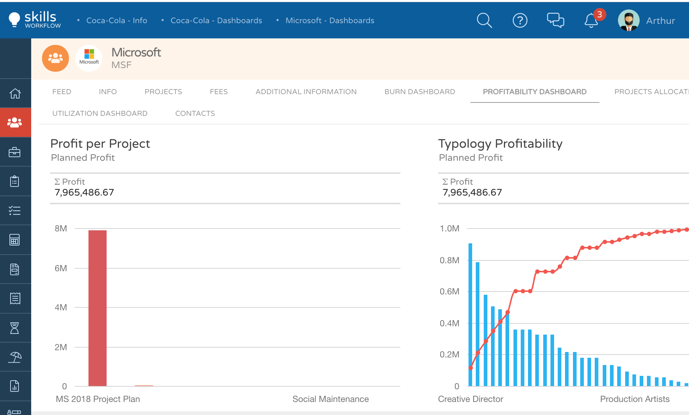
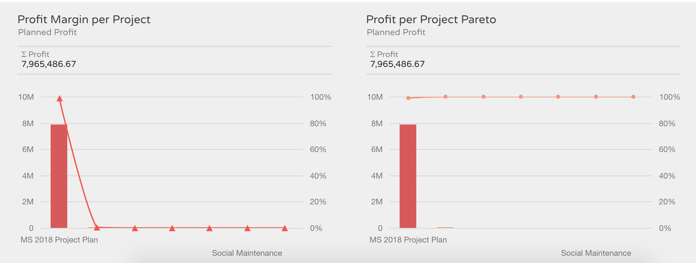

Client Dashboards
=================

Dashboards are a powerful feature used to quickly support decisions related to a specific client or project.

The goal is to give the ability to control processes in a very friendly and comprehensive way.

As a project manager is very useful to understand the status of a specific client and control the profitability of each project. This way the PM will have the tools to negotiate with their clients.

There are several Dashboards at the client level available in the system that will display different information.

.. note:: Burn Dashboard

1. Go to the client module
2. Select the client you want to check
3. Press on Burn Dashboard 

You will find out a summary with total indicators:

Planned, actual, revenue and cost 

.. image:: client-dashboard/Image1.png
    :align: center
    :width: 80%

1. Select the project you wish to analyze
    
    * The system will display several graphics with detailed information related to the selected project
    * You will be able to check total values for that specific project such as contracted hours, planned hours, actual hours, planned revenue, and actual cost.
    * Also, you will be able to find the burn percentage (planned - actual hours)

**Project Time Burn**

    * This representation will show you a monthly distribution of planned versus actual hours.
    * You will find out the same representation of the accumulated values as well.

**Project Revenue Burn**

    * This representation will show you a monthly distribution of planned revenue versus actual cost (based on user cost*actual hours).
    * You will also find out the same representation of the corresponding accumulated values

 

.. note:: Profitability Dashboard

1. Go to the client module;
2. Select the client you want to check;
3. Press on Profitability Dashboard 

This Dashboard shows you in a glimpse the projects, under the client you have selected, 
which returns you a higher profit (based on the income value quoted to the client)

You will be able to analyze the planned profit per project, and per typology.

Additionally, you will be able to check the profit margin per project by percentage and value, and the profit per project (based on planned hours income, and actual hours cost) with the Pareto representation

 

.. note:: Project Allocation Dashboard

1. Go to the client module;
2. Select the client you want to check;
3. Press on Project Allocation Dashboard 

Project Allocation Dashboard will show you a table where you can check the following information per project:

1. Users Capacity;
2. Actual hours already registered in the system;
3. Billable hours registered;
4. Allocation % 

.. image:: client-dashboard/Image4.png
    :align: center
    :width: 80%

Please note that this dashboard is a table and allows you to add more fields if needed.

To do so you should press on the icon at your right (marked in orange), and the system will show a field chooser as an Excel pivot table.

.. image:: client-dashboard/Image5.png
    :align: center
    :width: 80%

Please note that you can either export to excel or print out this dashboard by pressing outside the grid with the right function of your mouse. 